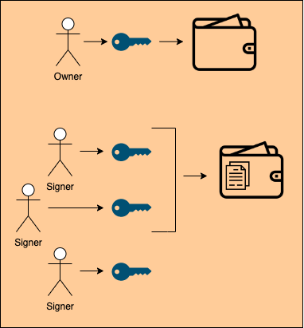
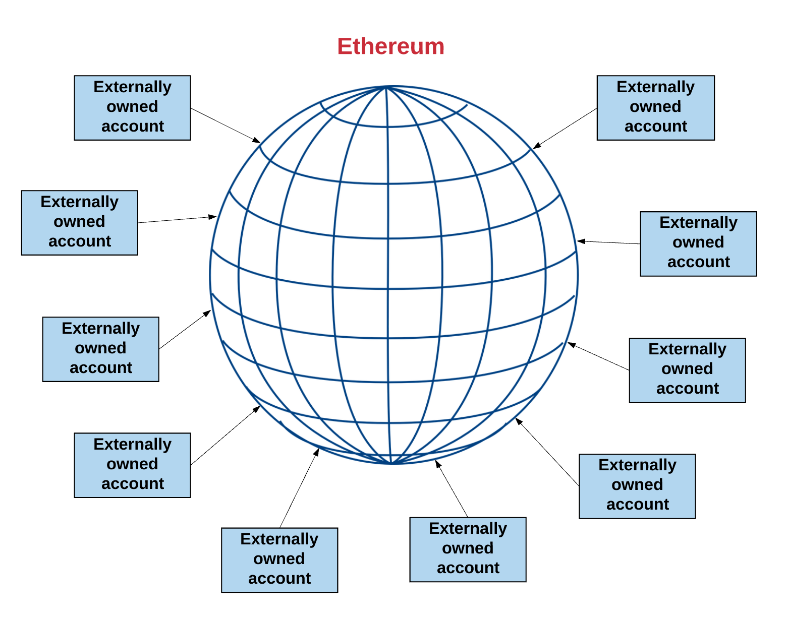
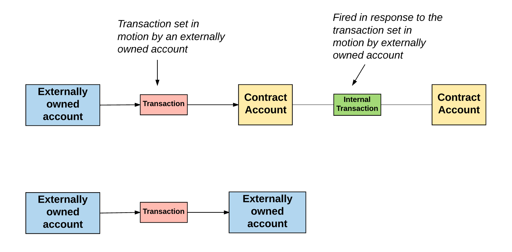
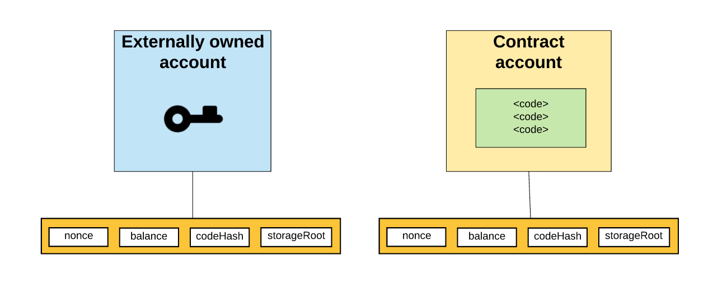

# Smart Contract Developer Bootcamp - İTÜ Blockchain

Bu dersimizde çeşitli organizasyon fonlarının ve akıllı kontratlarının yönetiminde sıklıkla başvurduğumuz Multisig yani "Çoklu İmza Gerektiren" cüzdanlara yönelik basit bir akıllı kontrat örneği geliştirdik. Ayrıca bu örnekle beraber ise Ethereum cüzdan / hesap modelinin nasıl çalıştığına değindik.

 

 

 

[Video İçeriği](https://www.youtube.com/watch?v=XbMWZj0BYvA)

[Wallet Kontratı](./MultiSig.sol)
