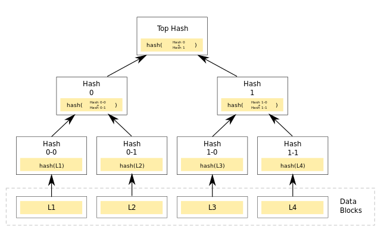

# Smart Contract Developer Bootcamp - İTÜ Blockchain

Bu dersimizde, "Whitlesit ve Airdrop" gibi durumlarda adres listelerinin blockchaine iletilmesinde sıklıkla başvurulan kriptografik bir kanıtlama yöntemi olan "Merkle Proof"ların akıllı kontratlara nasıl entegre edilebileceğine yönelik bir örnek yaptık.



Sıfırdan merkle script'i hazırlamak için:

```bash
    npm init -y

    npm i merkletreejs

    npm i keccak256

    npm i ethers

    node merkle
```

Klasörü klonlayıp çalışmak için:

```bash
    npm i
```
[Video İçeriği](https://youtu.be/9gGkPPui_tw)

[Merkle Tree Oluşturma Scripti](.merkle.js)

[Uygulama Örneği](./WLMint.sol)

[Merkle Proof Contract (Link Below)](./Merkle.sol)

[ENS Merkle Proof Contract Link](https://github.com/ensdomains/governance/blob/master/contracts/MerkleProof.sol)

[OpenZeppelin Bitmaps](https://docs.openzeppelin.com/contracts/4.x/api/utils#BitMaps)