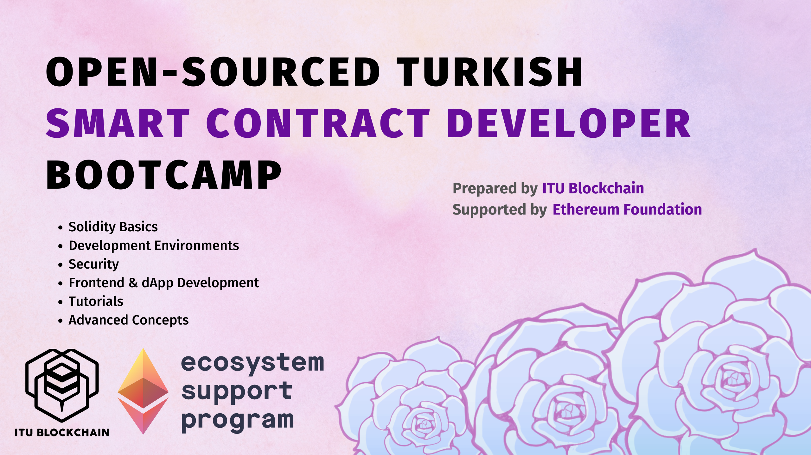

# Open-Sourced Turkish Smart Contract Developer Bootcamp - ITU Blockchain

 

Our bootcamp contains different subjects about blockchain & smart contract development knowledge. We have a team of students working on this project who are experts in the selected subjects.

We started to work on expanding our training content, which we started to prepare in February 2022, with the support we received from Ethereum Foundation. 

You can reach the [curriculum](#curriculum) we have prepared in line with the education in this section. After the completion of the specified contents, we will work to expand it with pleasure.

Please [contact us](mailto:blockchain@itu.edu.tr) if you are willing to contribute this project.

[Our Youtube Channel](https://www.youtube.com/c/ITUBlockchain/)

[Follow Us in Twitter](https://twitter.com/ITUBlockchain)

[Join Our Discord Server, Get Jr.Dev Role, and Meet Buidlers](https://discord.gg/5HzQ4QzBGS)

 

# Meet the Instructors

All of the educational content are prepared by our board & community members by ❤️

* [0xulas.eth](https://twitter.com/ulerdogan)
* [alimsahin.eth](https://twitter.com/aalimsahin)
* [tahos.eth](https://twitter.com/0xTahos)
* [zetsub0ii.eth](https://twitter.com/hamza_krb)
* [farhad](https://twitter.com/asgarovf)

 

# Curriculum

## Solidity Basics

This part contains basic Solidity knowledge that required to understand the syntax of the language and write smart contracts.

| Headline          | Topic                 | Instructor    | Status     | Code |
| :---------------- | :-------------------- | :------------ | :--------- | :--: |
| Solidity Basics   | Introduction          | [0xulas.eth](https://twitter.com/ulerdogan)    | [Published](https://www.youtube.com/watch?v=7qeT0ieH1V4&list=PLby2HXktGwN4Cof_6a8YwlMrboX8-hs73&index=1)  | 0x0  |
| Solidity Basics   | Variables & Scopes    | [alimsahin.eth](https://twitter.com/aalimsahin) | [Published](https://www.youtube.com/watch?v=qE6-H1NBraw&list=PLby2HXktGwN4Cof_6a8YwlMrboX8-hs73&index=2)  | 1x0  |
| Solidity Basics   | Functions             | [alimsahin.eth](https://twitter.com/aalimsahin) | [Publihed](https://www.youtube.com/watch?v=J_B_uPnspws&list=PLby2HXktGwN4Cof_6a8YwlMrboX8-hs73&index=3)  | 1x1  |
| Solidity Basics   | Constructor           | [alimsahin.eth](https://twitter.com/aalimsahin) | [Published](https://www.youtube.com/watch?v=XQR2tL4v0_c&list=PLby2HXktGwN4Cof_6a8YwlMrboX8-hs73&index=4)  | 1x2  |
| Solidity Basics   | Control Structures    | [0xulas.eth](https://twitter.com/ulerdogan)    | [Published](https://www.youtube.com/watch?v=a9PtEe3CXSg&list=PLby2HXktGwN4Cof_6a8YwlMrboX8-hs73&index=5)  | 1x3  |
| Solidity Basics   | Mappings              | [0xulas.eth](https://twitter.com/ulerdogan)    | [Published](https://www.youtube.com/watch?v=aZDdyhfesEc&list=PLby2HXktGwN4Cof_6a8YwlMrboX8-hs73&index=6)  | 1x4  |
| Solidity Basics   | Structs               | [0xulas.eth](https://twitter.com/ulerdogan)    | [Published](https://www.youtube.com/watch?v=lV_QtWkp3MY&list=PLby2HXktGwN4Cof_6a8YwlMrboX8-hs73&index=7&t=2s)  | 1x5  |
| Solidity Basics   | Modifiers             | [0xulas.eth](https://twitter.com/ulerdogan)    | [Published](https://www.youtube.com/watch?v=58MDeT4hoig&list=PLby2HXktGwN4Cof_6a8YwlMrboX8-hs73&index=8&t=2s)  | 1x6  |
| Solidity Basics   | Events                | [0xulas.eth](https://twitter.com/ulerdogan)    | [Published](https://www.youtube.com/watch?v=wM63xPvUekM&list=PLby2HXktGwN4Cof_6a8YwlMrboX8-hs73&index=9&t=2s)  | 1x7  |
| Solidity Basics   | Sending Ethers        | [alimsahin.eth](https://twitter.com/aalimsahin) | [Published](https://www.youtube.com/watch?v=TUQzMu4DYjc&list=PLby2HXktGwN4Cof_6a8YwlMrboX8-hs73&index=11)  | 1x8  |
| Solidity Basics   | Errors                | [0xulas.eth](https://twitter.com/ulerdogan)    | [Published](https://www.youtube.com/watch?v=TUQzMu4DYjc&list=PLby2HXktGwN4Cof_6a8YwlMrboX8-hs73&index=11)  | 1x9 |
| Solidity Basics   | Libraries             | [alimsahin.eth](https://twitter.com/aalimsahin) | [Published](https://www.youtube.com/watch?v=azSY27x8pxc&list=PLby2HXktGwN4Cof_6a8YwlMrboX8-hs73&index=12&t=2s)  | 1x10 |
| Solidity Basics   | Data Locations        | [zetsub0ii.eth](https://twitter.com/hamza_krb) | [Published](https://www.youtube.com/watch?v=MzvzBp9l3y0&list=PLby2HXktGwN4Cof_6a8YwlMrboX8-hs73&index=13)  | 1x11 |
| Solidity Basics   | Inheritance           | [alimsahin.eth](https://twitter.com/aalimsahin) | [Published](https://www.youtube.com/watch?v=KSrhlrHlti4&list=PLby2HXktGwN4Cof_6a8YwlMrboX8-hs73&index=14&t=2s)  | 1x12 |
| Solidity Basics   | Interacting Contracts | [0xulas.eth](https://twitter.com/ulerdogan)    | [Published](https://www.youtube.com/watch?v=BWC-Rlkjs54&list=PLby2HXktGwN4Cof_6a8YwlMrboX8-hs73&index=15)  | 1x13 |
| Solidity Basics   | Interfaces            | [zetsub0ii.eth](https://twitter.com/hamza_krb) | [Published](https://www.youtube.com/watch?v=QZDvZD-lczM&list=PLby2HXktGwN4Cof_6a8YwlMrboX8-hs73&index=16)  | 1x14 |
| Solidity Basics   | Call                  | [0xulas.eth](https://twitter.com/ulerdogan)    | [Published](https://www.youtube.com/watch?v=NBJIBoxDpDs&list=PLby2HXktGwN4Cof_6a8YwlMrboX8-hs73&index=17&t=1s)  | 1x15 |
| Solidity Basics   | Creating Contracts    | [0xulas.eth](https://twitter.com/ulerdogan)    | [Published](https://www.youtube.com/watch?v=0stIYoi3KG8&list=PLby2HXktGwN4Cof_6a8YwlMrboX8-hs73&index=19&t=3037s)  | 1x16 |

## Development Environments

This part introduces the most popular developer tools, libraries, and environments for smart contract development. Also, uses these tools for testing and network interaction.

| Headline          | Topic                 | Instructor    | Status     | Code |
| :---------------- | :-------------------- | :------------ | :--------- | :--: |
| Dev. Environments | Hardhat & Ethers      | [0xulas.eth](https://twitter.com/ulerdogan)    | [Published](https://www.youtube.com/watch?v=0stIYoi3KG8&list=PLby2HXktGwN4Cof_6a8YwlMrboX8-hs73&index=19&t=3037s)  | 2x0  |
| Dev. Environments | Hardhat Advanced      | [0xulas.eth](https://twitter.com/ulerdogan)    | [Published](https://www.youtube.com/watch?v=FyaivvNkrBE&ab_channel=ITUBlockchain)  | 2x1  |
| Dev. Environments | Hardhat vs Foundry    | [zetsub0ii.eth](https://twitter.com/hamza_krb) | [Published](https://www.youtube.com/watch?v=1h43HzpzEvo&ab_channel=ITUBlockchain)  | 2x2  |
| Dev. Environments | Foundry Introduction  | [tahos.eth](https://twitter.com/0xTahos)     | [Published](https://www.youtube.com/watch?v=kT1S2jKr0ns&list=PLby2HXktGwN6V6Rw_cK86pG0cirteMB90&index=4&t=10s)  | 2x3  |
| Dev. Environments | Foundry Tests         | [tahos.eth](https://twitter.com/0xTahos)     | [Published](https://www.youtube.com/watch?v=F0GvdvVeYC4&list=PLby2HXktGwN6V6Rw_cK86pG0cirteMB90&index=5)  | 2x4  |
| Dev. Environments | Foundry Cheat Codes   | [tahos.eth](https://twitter.com/0xTahos)     | [Published](https://www.youtube.com/watch?v=LGztd14iTwo&ab_channel=ITUBlockchain)  | 2x4  |
| Dev. Environments | Foundry IV            | [tahos.eth](https://twitter.com/0xTahos)     | Preparing  | 2x5  |
| Dev. Environments | Go-Ethereum           | [0xulas.eth](https://twitter.com/ulerdogan)    | Postponed  | 2x6  |
| Dev. Environments | Brownie & web3py      | [zetsub0ii.eth](https://twitter.com/hamza_krb) | Postponed  | 2x7  |

## Frontend & dApp Development

This part uses React for creating UI's for smart contracts and create Web3 dApps. Also, lastly introduces [Ethylene.js](https://ethylene.itublockchain.com/) which is a React library prepared for us for React dApps.

| Headline          | Topic                 | Instructor    | Status     | Code |
| :---------------- | :-------------------- | :------------ | :--------- | :--: |
| Frontend & dApp   | Custom Hooks & Init.  | [farhad](https://twitter.com/asgarovf)        | [Published](https://www.youtube.com/watch?v=rMOofoBaryU&list=PLby2HXktGwN4Cof_6a8YwlMrboX8-hs73&index=24)  | 3x0  |
| Frontend & dApp   | Wallet Conn. & Ethers | [farhad](https://twitter.com/asgarovf)        | [Published](https://www.youtube.com/watch?v=QyC50nETRMc&list=PLby2HXktGwN4Cof_6a8YwlMrboX8-hs73&index=25)  | 3x1  |
| Frontend & dApp   | Contract Init.        | [farhad](https://twitter.com/asgarovf)        | [Published](https://www.youtube.com/watch?v=15PhvaArdWU&list=PLby2HXktGwN4Cof_6a8YwlMrboX8-hs73&index=26)  | 3x2  |
| Frontend & dApp   | Sending TXs           | [farhad](https://twitter.com/asgarovf)        | [Published](https://www.youtube.com/watch?v=HZCNT4N5nfs)  | 3x3  |
| Frontend & dApp   | Redux Toolkit         | [farhad](https://twitter.com/asgarovf)        | [Published](https://www.youtube.com/watch?v=Ge8Qcu4Q2yY)  | 3x4  |
| Frontend & dApp   | Event Listening       | [farhad](https://twitter.com/asgarovf)        | [Published](https://www.youtube.com/watch?v=-mUx6y0VKGg)  | 3x5  |
| Frontend & dApp   | MM Network Management | [farhad](https://twitter.com/asgarovf)        | Preparing  | 3x6  |
| Frontend & dApp   | Web3 Modal            | [farhad](https://twitter.com/asgarovf)        | Preparing  | 3x7  |
| Frontend & dApp   | Intro. to Ethylene.js | [farhad](https://twitter.com/asgarovf)        | Preparing  | 3x8  |

## Security

This part includes content about Ethereum smart contract security and introduces common mistakes or attacks, then explains some tools.

| Headline          | Topic                 | Instructor    | Status     | Code |
| :---------------- | :-------------------- | :------------ | :--------- | :--: |
| Security          | Security I            | [zetsub0ii.eth](https://twitter.com/hamza_krb) | [Published](https://www.youtube.com/watch?v=SqTW-uKnsoE&ab_channel=ITUBlockchain)  | 4x0  |
| Security          | Security II           | [zetsub0ii.eth](https://twitter.com/hamza_krb) | [Published](https://youtu.be/QM1H84Z_Qtg)  | 4x1  |
| Security          | Slither               | [zetsub0ii.eth](https://twitter.com/hamza_krb) | Preparing  | 4x2  |
| Security          | Echidna               | [zetsub0ii.eth](https://twitter.com/hamza_krb) | Preparing  | 4x3  |
| Security          | Post Mortem Analyses  | [tahos.eth](https://twitter.com/0xTahos)     | Continual  | 4x4  |

## Tutorials

This part introduces some well-known usecases and contracts.

| Headline          | Topic                 | Instructor    | Status     | Code |
| :---------------- | :-------------------- | :------------ | :--------- | :--: |
| Tutorials         | ERC-20                | [alimsahin.eth](https://twitter.com/aalimsahin) | [Published](https://www.youtube.com/watch?v=qwrJPcqydTE&ab_channel=ITUBlockchain)  | 5x0  |
| Tutorials         | ERC-721               | [alimsahin.eth](https://twitter.com/aalimsahin) | [Published](https://www.youtube.com/watch?v=zf4orRramo4)  | 5x1  |
| Tutorials         | ERC-1155              | [alimsahin.eth](https://twitter.com/aalimsahin) | [Published](https://www.youtube.com/watch?v=crX5IcUX3qE)  | 5x2  |
| Tutorials         | Marketplace Contracts | [alimsahin.eth](https://twitter.com/aalimsahin) | Preparing  | 5x3  |
| Tutorials         | Marketplace Interface | [alimsahin.eth](https://twitter.com/aalimsahin) | Preparing  | 5x4  |
| Tutorials         | Multisig Wallet       | [0xulas.eth](https://twitter.com/ulerdogan)    | Preparing  | 5x5  |
| Tutorials         | Simple Game           | [0xulas.eth](https://twitter.com/ulerdogan)    | Preparing  | 5x6  |
| Tutorials         | Bridge Contracts      | [zetsub0ii.eth](https://twitter.com/hamza_krb) | Preparing  | 5x7  |
| Tutorials         | Bridge Backend        | [zetsub0ii.eth](https://twitter.com/hamza_krb) | Preparing  | 5x8  |
| Tutorials         | Staking Contract      | [tahos.eth](https://twitter.com/0xTahos)     | Preparing  | 5x9  |
| Tutorials         | DEX                   | [zetsub0ii.eth](https://twitter.com/hamza_krb) | Preparing  | 5x10 |

## Advanced Concepts

This part introduces some advanced concepts in smart contract developing.

| Headline          | Topic                 | Instructor    | Status     | Code |
| :---------------- | :-------------------- | :------------ | :--------- | :--: |
| Advanced Concepts | Merkle Trees          | [0xulas.eth](https://twitter.com/ulerdogan)    | Preparing  | 6x0  |
| Advanced Concepts | Gas Optimizations     | [tahos.eth](https://twitter.com/0xTahos)     | Preparing  | 6x1  |
| Advanced Concepts | Proxy Contracts       | [tahos.eth](https://twitter.com/0xTahos)     | Preparing  | 6x2  |
| Advanced Concepts | NFT Collections       | [alimsahin.eth](https://twitter.com/aalimsahin) | Preparing  | 6x3  |
| Advanced Concepts | LayerZero Application | [alimsahin.eth](https://twitter.com/aalimsahin) | Preparing  | 6x4  |
| Advanced Concepts | Assembly I            | [tahos.eth](https://twitter.com/0xTahos)     | Preparing  | 6x5  |
| Advanced Concepts | Assembly II           | [zetsub0ii.eth](https://twitter.com/hamza_krb) | Preparing  | 6x6  |
| Advanced Concepts | Chainlink Application | [alimsahin.eth](https://twitter.com/aalimsahin) | Preparing  | 6x7  |

